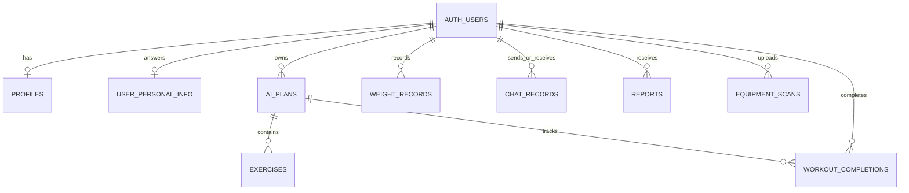

# PaceHealth Database Schema Guide

This document explains the current Supabase database design in plain language. It is intended for the backend, Flutter, and AI teammates to review together before treating the schema as final.

The executable SQL is in `backend/supabase/schema.sql`.

## Architecture

```text
Flutter application
       |
       | JSON over HTTP + Supabase access token
       v
FastAPI backend
       |
       | Validates the user and applies business rules
       v
Supabase Auth + PostgreSQL
       |
       | Stored profile, questionnaire, plan, weight, chat, and report data
       v
Stephanie's AI functions
```

Flutter should use the public API field names from `docs/API_CONTRACT.md`. It should not use the database tables or the backend secret key directly.

## Naming convention

Flutter and HTTP JSON use `camelCase`:

```json
{
  "currentWeightKg": 68,
  "exerciseFrequencyPerWeek": 3
}
```

Python and PostgreSQL use `snake_case`:

```text
current_weight_kg
exercise_frequency_per_week
```

FastAPI converts between the two formats. Different internal database names do not change the public API contract.

## Main relationships



`auth.users` is managed by Supabase Auth. PaceHealth does not store raw passwords or password hashes in its own public tables.

## Tables

### `auth.users`

Supabase owns this table. It stores authentication identity such as the user's UUID and email.

It replaces the proposed `Login` table from the original planning document. The backend must never create a separate table containing user passwords.

### `profiles`

Stores the user's basic health profile and fitness goal.

| Column | Meaning |
|---|---|
| `user_id` | Supabase Auth user UUID and primary key |
| `name` | Display name |
| `age` | User age |
| `sex` | Sex value agreed with Flutter |
| `height_cm` | Height in centimetres |
| `current_weight_kg` | Current design uses the document's `currentWeightKg` field |
| `target_weight_kg` | Target weight in kilograms |
| `goal` | Example: `lose_weight` or `gain_muscle` |
| `lifestyle` | Description used for personalization |
| `exercise_frequency_per_week` | Planned exercise sessions per week |
| `exercise_duration_minutes` | Preferred duration of one session |
| `exercise_location` | Example: home, gym, or outdoor |
| `created_at` | Creation timestamp |
| `updated_at` | Latest update timestamp |

There is one profile per authenticated user.

### `user_personal_info`

Stores the personalized fitness questionnaire.

| Column | Meaning |
|---|---|
| `user_id` | Supabase Auth user UUID and primary key |
| `available_equipment` | List of equipment |
| `posture_issues` | List of posture concerns |
| `injuries` | List of injuries |
| `surgery_history` | List of previous surgeries |
| `exercises_to_avoid` | Exercises that should not be recommended |
| `updated_at` | Latest update timestamp |

PostgreSQL arrays are used because Stephanie's AI request expects lists of strings.

### `ai_plans`

Stores one generated plan header. A user may generate multiple plans over time.

| Column | Meaning |
|---|---|
| `id` | Plan UUID; exposed as `planId` when needed |
| `user_id` | Owner of the plan |
| `plan_name` | AI-generated plan name |
| `goal` | Goal represented by this plan |
| `weekly_frequency` | Number of training days per week |
| `created_at` | Generation timestamp |

### `exercises`

Stores individual exercises belonging to an AI plan. This table represents the original document's `SportsType` concept using a clearer name.

| Column | Meaning |
|---|---|
| `id` | Internal exercise-row ID |
| `plan_id` | Parent AI plan |
| `day` | Template day such as `Day 1` |
| `exercise_name` | Exercise name |
| `sets` | Number of sets |
| `reps` | Repetitions for strength exercises |
| `duration_seconds` | Duration for cardio or stretching |
| `rest_seconds` | Rest between sets |
| `reason` | Personalized reason for recommending it |
| `video_url` | Optional demonstration video |

Exactly one of `reps` and `duration_seconds` must have a value, following Stephanie's AI response contract.

### `weight_records`

Stores the user's weight history.

| Column | Meaning |
|---|---|
| `id` | Record UUID; exposed as `weightLogId` |
| `user_id` | Owner of the measurement |
| `weight_kg` | Weight in kilograms |
| `recorded_at` | Date of the measurement |
| `created_at` | Timestamp when it was saved |

The current schema allows one record per user per date.

### `chat_records`

Stores conversation history so the backend can provide previous messages to Stephanie's stateless AI chat function.

| Column | Meaning |
|---|---|
| `id` | Message UUID; exposed as `messageId` |
| `user_id` | Conversation owner |
| `role` | `user` or `assistant` |
| `message` | Message text |
| `created_at` | Message timestamp |

Messages must be retrieved in chronological order before calling `/ai/chat`.

### `reports`

Stores generated weekly or monthly report results.

| Column | Meaning |
|---|---|
| `id` | Report UUID |
| `user_id` | Report owner |
| `period_type` | `weekly` or `monthly` |
| `period_start` | First date covered |
| `period_end` | Last date covered |
| `start_weight_kg` | First weight in the period |
| `end_weight_kg` | Last weight in the period |
| `delta_kg` | Weight change |
| `progress_to_goal_percent` | Progress toward the target |
| `projected_weeks_to_goal` | Estimated remaining weeks |
| `summary` | Stephanie's AI-generated written summary |
| `created_at` | Report generation timestamp |

Python calculates all numeric values. AI generates only `summary`.

### `equipment_scans`

Stores equipment images and future recognition results.

| Column | Meaning |
|---|---|
| `id` | Scan UUID |
| `user_id` | User who uploaded the image |
| `image_url` | Supabase Storage URL |
| `equipment_name` | Recognized equipment name |
| `confidence` | Recognition confidence from 0 to 1 |
| `ai_result` | Full structured recognition response |
| `created_at` | Upload timestamp |

Stephanie's current branch does not implement equipment recognition yet.

### `workout_completions`

Optional table for weekly completion statistics.

| Column | Meaning |
|---|---|
| `id` | Completion UUID |
| `user_id` | User who completed the workout |
| `plan_id` | Related AI plan |
| `day` | Completed template day, such as `Day 1` |
| `completed_at` | Completion timestamp |

This table tracks completion of a whole plan day, not every individual exercise.

## Security design

- Supabase Auth owns passwords and authentication identity.
- Flutter receives an access token after login.
- Flutter sends the token to FastAPI as `Authorization: Bearer <token>`.
- FastAPI validates the token and derives the authenticated `user_id`.
- FastAPI uses the Supabase backend secret to access tables.
- The secret key must never be placed in Flutter, GitHub, screenshots, or chat.
- Row Level Security is enabled on all application tables.
- No public table policies currently exist because data access goes through FastAPI.

## Decisions for the team meeting

### Decision 1: What does `currentWeightKg` mean?

Stephanie's report code treats it as the starting weight when the goal was created. Its name suggests it is always the latest weight.

Recommended decision:

- Rename it to `startingWeightKg`, or
- Keep `currentWeightKg` fixed while a goal is active and get the latest value from `weight_records`.

Do not continuously update it without also changing Stephanie's progress calculation.

### Decision 2: How many weight records are allowed per day?

Current design: one record per user per date.

Choose one:

- One daily record that can be replaced, or
- Multiple measurements using a full timestamp

### Decision 3: Should reports be saved?

Choose one:

- Generate and save reports for history, or
- Calculate reports dynamically each time

### Decision 4: Who calls Supabase Auth?

Current backend design: Flutter calls FastAPI `/auth/register` and `/auth/login`.

Alternative: Flutter uses Supabase Auth directly and only sends the access token to FastAPI.

The team must choose one flow so two different authentication implementations are not built.

### Decision 5: Should AI endpoints save automatically?

Recommended behavior:

- `/ai/generate-plan` saves the plan and exercises after Claude succeeds.
- `/ai/chat` saves both the user message and assistant reply.
- `/ai/report` loads weight records, calculates the report, and saves the result.

### Decision 6: Are optional features in the first demo?

Confirm whether the first demo includes:

- Equipment photo upload and recognition
- Workout completion tracking

### Decision 7: Final controlled values

Agree on exact values for:

- `sex`
- `goal`
- `exerciseLocation`
- Any questionnaire multiple-choice fields

This prevents Flutter, FastAPI, and AI from using different spellings.

## Recommended meeting outcome

Before ending the meeting, record a clear answer for every decision above. Then update:

1. `backend/supabase/schema.sql`
2. `docs/API_CONTRACT.md`
3. Flutter models and API calls
4. Stephanie's Pydantic AI models if any public field changes

Do not change public field names independently. All three teammates must use the same JSON contract.
